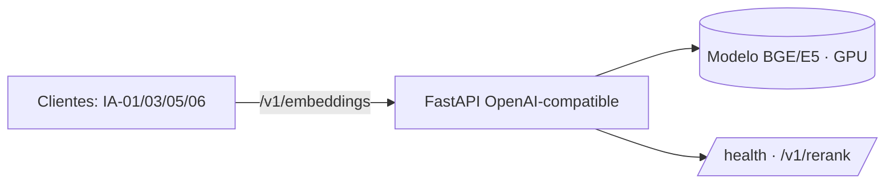

<p align="center">
<a href="https://www.linkedin.com/in/soriamaximilianorodrigo/" target="_blank" rel="noopener noreferrer">
</a>
</p>

<p align="center">
  
  
  
  
</p>

<p align="center">
  
</p>

<hr/>

<h1 align="center">ia-07-embeddings-service</h1>

<p align="center">
Servicio de <b>embeddings self-hosted</b> con API <b>OpenAI-compatible</b> (FastAPI): la pieza fundacional que consumen el resto de los proyectos.
</p>

## ¿Qué resuelve este proyecto?

Enviar código, logs o esquemas propietarios a una API de embeddings externa choca con privacidad/GDPR; el fallback por hashing degrada la calidad. Este microservicio expone embeddings (y reranking) con una **API OpenAI-compatible**, para que todo el ecosistema lo consuma sin cambiar clientes, manteniendo **el dato dentro de tu red**. Es la pieza **fundacional** de la capa de IA.

## ¿Qué pasos sigue?

Clientes idénticos a OpenAI pegan a `/v1/embeddings`; por defecto sirve con un embedder offline, y en producción se reemplaza por BGE/E5 en GPU manteniendo el mismo contrato.



## Componentes principales

- **`create_app`** — app FastAPI con `/v1/embeddings`, `/v1/rerank`, `/health`.
- **`ia_core.HashingEmbedder`** — backend offline por defecto (sin GPU).
- **Contrato OpenAI-compatible** — se cambia el modelo real sin tocar clientes.

## ¿Por qué así?

Mantener el contrato OpenAI significa que `mk5-toolkit` y los demás no cambian de cliente al pasar de la nube a local. Con el servicio local, el corpus **nunca sale de la red** — base para que los agentes corran 100% privados.

## Uso

```bash
pip install -e ".[dev]"
pytest -q
```

> Parte del portafolio de **Maximiliano Rodrigo Soria** — capa de IA sobre el ecosistema
> de 9 backends. Corre **offline** (embedder por hashing + LLM stub deterministas);
> en producción se cambian los adaptadores por los reales (IA-07 local / API OpenAI-compatible)
> por los mismos puertos. Diseño y contrato completos en [`TASK.md`](./TASK.md).
