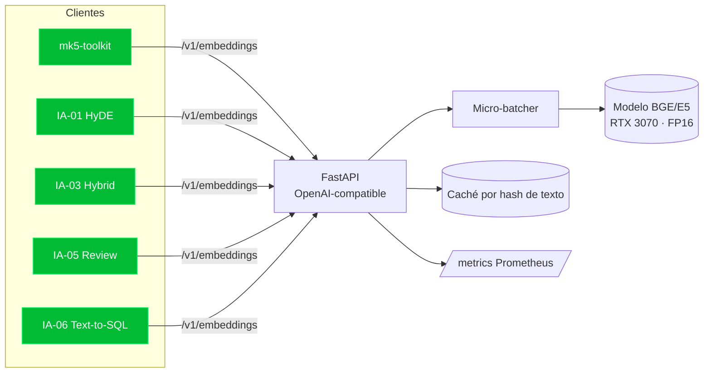

# IA-07 · Servicio de embeddings self-hosted (FastAPI + GPU)

> Propuesta técnica independiente. Microservicio que sirve **embeddings locales** con un
> modelo open (BGE / E5) en tu **RTX 3070**, para que `mk5-toolkit` y el resto de los
> proyectos de IA no dependan de APIs externas. Resuelve tus preocupaciones de
> privacidad / GDPR. Es la **pieza fundacional** que consumen IA-01, IA-03, IA-05, IA-06.

---

## 1. Contexto y objetivo

Hoy la capa de embeddings de `mk5-toolkit` puede caer en APIs externas o en un fallback
por hashing (offline, no semántico). Enviar código, logs o esquemas propietarios a un
tercero choca con privacidad/GDPR; el fallback por hashing degrada la calidad semántica.

**Objetivo:** un servicio local que exponga embeddings (y opcionalmente reranking y un
LLM chico) sobre GPU, con una **API OpenAI-compatible** para que todo el ecosistema lo
consuma sin cambiar clientes, manteniendo **el dato dentro de tu red**.

## 2. Alcance

**In:** carga del modelo en GPU, endpoint de embeddings (batch), API OpenAI-compatible,
health/readiness, métricas, caché, contenedor con acceso a GPU, degradación a CPU.

**Out:** entrenamiento/fine-tuning; el LLM generativo grande (puede convivir, pero el
foco es embeddings + reranker); orquestación de RAG (vive en los otros proyectos).

## 3. Decisiones arquitectónicas (trade-offs)

| Decisión | Elección | Trade-off |
|----------|----------|-----------|
| Modelo | **BGE-M3 / E5** (multilingüe, calidad alta) | Buen equilibrio calidad/VRAM para 8 GB |
| Cuantización | FP16 (o INT8 si hace falta VRAM) | INT8 ahorra memoria con leve pérdida de calidad |
| Runtime | FastAPI + `sentence-transformers`/`fastembed`; opción ONNX Runtime GPU | ONNX acelera inferencia; ST es más simple |
| API | **OpenAI-compatible** (`/v1/embeddings`) | Los clientes existentes no cambian |
| Batching | Micro-batching dinámico | Sube throughput en GPU; leve latencia de espera |
| Fallback | CPU si no hay GPU | El servicio nunca queda caído por falta de GPU |

## 4. Arquitectura



## 5. Stack por capa

- **Servicio (Python):** FastAPI + Uvicorn; `sentence-transformers` o `fastembed` con
  backend GPU (CUDA); opción **ONNX Runtime GPU** / TensorRT para más throughput.
- **Modelos:** BGE-M3 o E5 para embeddings; `bge-reranker` opcional en `/v1/rerank`.
- **Infra:** contenedor con NVIDIA Container Toolkit (`--gpus all`); healthcheck que
  verifica GPU visible; degradación a CPU documentada.
- **Consistencia con el portafolio:** aunque el runtime es Python, replica el estándar
  transversal —métricas Prometheus, health/readiness estilo Actuator, logs con requestId,
  Docker multi-stage, manifiestos k8s, CI GitHub Actions—.
- **Consumo desde JVM:** los servicios Java lo usan por su cliente OpenAI-compatible
  detrás de un `EmbeddingPort` con Resilience4j (Retry + CircuitBreaker + TimeLimiter).

## 6. Contrato (OpenAI-compatible)

```
POST /v1/embeddings
{ "model":"bge-m3", "input":["texto 1","texto 2"] }
→ 200 { "data":[ {"embedding":[...],"index":0}, {"embedding":[...],"index":1} ],
        "model":"bge-m3", "usage":{"prompt_tokens":123} }

POST /v1/rerank
{ "query":"...", "documents":["...","..."], "top_n":5 }
→ 200 { "results":[ {"index":3,"relevance_score":0.91}, ... ] }

GET /health   → { "status":"UP", "gpu":true, "model":"bge-m3" }
GET /metrics  → Prometheus
```

## 7. Roadmap por fases

1. **F1 — Embeddings en GPU:** carga del modelo, `/v1/embeddings` batch, health. *DoD:*
   `mk5-toolkit` indexa contra el servicio local.
2. **F2 — Rendimiento:** micro-batching, caché, medición de throughput/latencia y VRAM.
3. **F3 — Reranker:** `/v1/rerank` (habilita la capa opcional de IA-02/IA-03).
4. **F4 — Operación:** contenedor GPU, k8s, degradación a CPU, dashboard Grafana.

## 8. Observabilidad, seguridad y testing

- **Privacidad/GDPR (el porqué del proyecto):** el corpus (código, logs, esquemas)
  **nunca sale de tu red**; base para que IA-01/04/05/06 corran 100% local.
- **Observabilidad:** latencia p50/p95, throughput (embeddings/s), uso de VRAM, tasa de
  caché, batch size efectivo.
- **Testing:** contrato OpenAI-compatible (WireMock del lado cliente), test de estabilidad
  numérica (mismo texto → mismo vector), prueba de carga con `_k6`, degradación a CPU.

## 9. Riesgos y mitigaciones

| Riesgo | Mitigación |
|--------|-----------|
| VRAM insuficiente (8 GB) en batches grandes | Cuantización INT8, tope de batch, modelo dimensionado |
| GPU caída → servicio inutilizable | Fallback a CPU + health que lo refleja |
| Deriva de versión de modelo cambia vectores | Fijar versión; reindexar si cambia; registrar `model` en cada corrida |
| Cliente asume dimensión fija | Exponer dimensión en `/health`; validar en el cliente |

## 10. Definition of Done

- [ ] `/v1/embeddings` sirviendo BGE/E5 en GPU, OpenAI-compatible.
- [ ] `mk5-toolkit` y los demás proyectos consumen el servicio local (sin API externa).
- [ ] Micro-batching + caché + métricas de throughput/latencia/VRAM.
- [ ] Degradación a CPU y health que reporta estado de GPU.
- [ ] Contenedor con GPU + k8s + CI; pruebas de contrato y carga verdes.
